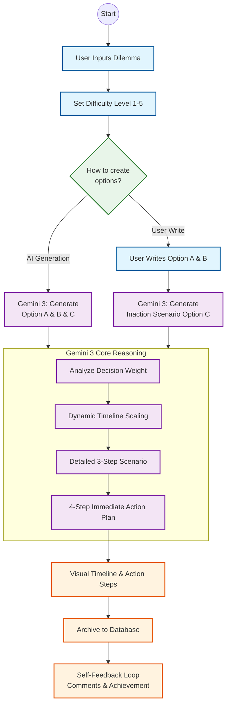

# Kairos Flow: Decision Support Engine

> *"Stop overthinking, start evolving."*

**Kairos Flow** is an AI-powered decision-support application built with **Flutter** and **Gemini 3**, designed to help users break free from decision paralysis and visualize their future.

---

## 🚀 Inspiration

Modern life demands too many decisions, leading to _"decision paralysis"_ and mental energy depletion. I built Kairos Flow to help people realize that **inaction is also a choice**—one with hidden costs. By visualizing choices as dynamic timelines, I aim to help users regain their momentum.

---

## 🛠️ Key Features

- **Dilemma Quantification**: Objectively assess the weight of your concerns on a scale of \\( 1 \\) to \\( 5 \\).
- **Three-Path Modeling**: Visualize Option A & B (viable paths) and Option C (_The Inaction Path_) generated by Gemini 3.
- **Dynamic 3-Stage Timeline**: See your future across Near, Mid, and Long-term horizons, scaled by the severity of the decision.
- **4-Step Action Plan**: Receive immediate, manageable To-do lists to build instant momentum after deciding.
- **Reflective Archive**: A personal growth loop where you can track progress and leave feedback for your past self.

---

## 🏗️ System Architecture

---

## 🧠 Gemini 3 Integration

I utilized the **Gemini 3 API** as a _"Reasoning Engine"_ rather than a simple chatbot.

- **Prompt Engineering**: Rigorously tested in **Google AI Studio** to ensure structured JSON outputs.
- **Contextual Reasoning**: Powers the "Inaction Path" logic and dynamic timeline scaling based on decision complexity.

---

## 💻 Technical Stack

| Layer | Technology |
|-------|-----------|
| **Frontend** | Flutter (Cross-platform Mobile) |
| **AI Engine** | Google Gemini 3 API |
| **Database** | Hive (Local) & Firebase (Web Deployment) |

---

## 👨‍💻 About the Developer

Developed by **Song Yoo Sun**, a solo developer passionate about building empathetic technology that solves real-world mental fatigue.
